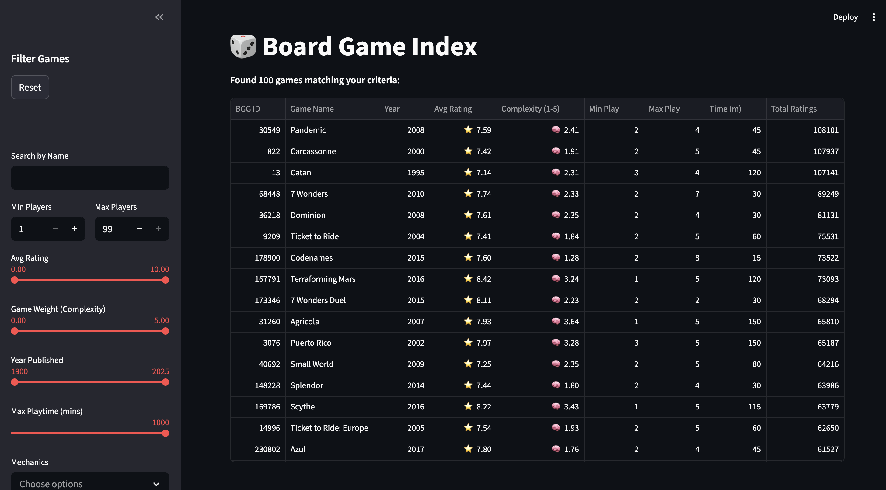

# 🎲 Board Game Index



## Overview
**Board Game Index** is a lightning-fast, locally hosted web application that allows you to explore, search, and filter a massive database of over 21,000 board games. 

Built with **Python**, **Streamlit**, and **PostgreSQL**, it parses an extensive BoardGameGeek dataset and normalizes it into a highly indexed relational database. This allows for instant, multi-faceted filtering across millions of data points—including mechanics, themes, player counts, ratings, and game complexity (weight).

## Features
- **Extensive Filtering**: Narrow down games by exact minimum/maximum player counts, average user rating, complexity (weight), and playtime.
- **Dynamic Tagging**: Multiselect dropdowns for **Mechanics**, **Themes**, and **Categories**. Selecting multiple tags acts as an `AND` filter (e.g., finding games that are *both* "Cooperative" and "Deck Building").
- **Live Search**: Text-based search to instantly find a game by its title.
- **Performance**: Powered by a locally hosted PostgreSQL database with custom indexes, allowing instantaneous queries across a dataset containing over 19 million user ratings.
- **Responsive UI**: A clean, single-page dashboard built with Streamlit that requires no scrolling to view the data.

## Example Use Cases

Here are a few ways you can use the filters to find the perfect game:

* **Heavy Strategy Night**
  * *Filters*: `Min Players: 4`, `Game Weight: 3.5 - 5.0`, `Mechanics: Worker Placement`
  * *Result*: Finds deep, complex games that accommodate your whole group.
  
* **Quick Family Fun**
  * *Filters*: `Max Playtime: 45`, `Game Weight: 1.0 - 2.0`, `Categories: Family Game`
  * *Result*: Light, fast-paced games perfect for playing with kids or casual gamers.
  
* **Highly Rated 2-Player Duel**
  * *Filters*: `Min Players: 2`, `Max Players: 2`, `Avg Rating: 8.0 - 10.0`
  * *Result*: The absolute best games specifically designed for exactly two players.

---

## Local Setup Instructions

Want to run this locally on your own machine? Follow these steps to build the database, import the dataset, and launch the UI.

### 1. Prerequisites
- **PostgreSQL** (version 14 or higher) installed and running.
- **Python 3.9+** installed.

### 2. Clone and Install Dependencies
Clone this repository to your local machine, then install the required Python packages (it is recommended to use a virtual environment):

```bash
git clone <your-repo-url>
cd BGG
pip install -r requirements.txt
```
*(Ensure `requirements.txt` includes `streamlit`, `pandas`, and `psycopg[binary]`)*

### 3. Database Setup
Ensure your local PostgreSQL service is running. Create a new empty database named `bgg`:

```bash
createdb bgg
```

Next, build the tables by running the schema script:
```bash
psql -d bgg -f schema.sql
```

### 4. Import the Data
Use the provided Python script to parse the CSV files and load them into your Postgres database. 

*(Note: Ensure the dataset CSVs are located in the correct directory. The `--include-user-ratings` flag will load ~19 million rows, which may take a few minutes.)*

```bash
python scripts/import_bgg.py \
  --dsn "dbname=bgg user=$USER host=localhost" \
  --data-dir "board-games-database-from-boardgamegeek/versions/4" \
  --include-user-ratings
```

### 5. Create Performance Indexes
Once the data is imported, run the indexing script to optimize the database for extremely fast filtering:

```bash
psql -d bgg -f indexes.sql
```

### 6. Run the App!
Launch the Streamlit interface:

```bash
streamlit run app.py
```
The application will automatically open in your default web browser!
